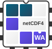

# netcdf4-wasm

[](https://www.npmjs.com/package/@earthyscience/netcdf4-wasm)
[](https://github.com/EarthyScience/netcdf4-wasm/blob/main/LICENSE)
[](https://www.unidata.ucar.edu/software/netcdf/)
[](https://www.typescriptlang.org/)
[](https://webassembly.org/)
[](https://emscripten.org/)
[](https://jestjs.io/)
[](https://kulshekhar.github.io/ts-jest/)




**Partial WebAssembly port of the NetCDF4 C library with TypeScript bindings for browser and Node.js**

`netcdf4-wasm` brings the power of NetCDF4 to web browsers and Node.js through WebAssembly. Read and write NetCDF files directly in JavaScript with a familiar, Python-inspired API.


**Features:**
- 🌐 Works in browsers and Node.js
- 📦 Partial NetCDF4 file format support
- 🐍 API modeled after [netcdf4-python](https://unidata.github.io/netcdf4-python)
- 🚀 High-performance WASM compilation
- 📝 Complete TypeScript type definitions

## Installation

```bash
npm install @earthyscience/netcdf4-wasm
```

## Quick Start

### Reading Files
```typescript
import { NetCDF4 } from '@earthyscience/netcdf4-wasm';

// Open existing file
const ds = await NetCDF4.fromBlobLazy(file);

// Access dimensions
// TODO: Add example

// Read variables
// TODO: Add example

// Close when done
ds.close();
```

### Working with Groups
```typescript
// Access groups
// TODO: Add example
```

### Writing Files
```typescript
import { NetCDF4 } from '@earthyscience/netcdf4-wasm';

// Create a new NetCDF file
// TODO: Add example
```

## API Reference

The API closely follows [netcdf4-python](https://unidata.github.io/netcdf4-python) conventions, making it intuitive for scientists familiar with Python.

**Core Classes:**
- `NetCDF4` - Main file interface
- 


## Advanced Usage

<details>
<summary><strong>Memory Configuration</strong></summary>

If you encounter memory-related errors with large files, you can increase the initial memory allocation:
```typescript
// TODO: Add example once API is stable
```
</details>

## Building from Source

See our [Contributing Guide](CONTRIBUTING.md) for detailed build instructions.

## Contributing

We welcome contributions! Please see our [Contributing Guide](CONTRIBUTING.md) for details.

## Resources

- [NetCDF4 C Library Documentation](https://docs.unidata.ucar.edu/netcdf-c/current/)
- [netcdf4-python Documentation](https://unidata.github.io/netcdf4-python)
- [GitHub Issues](https://github.com/EarthyScience/netcdf4-wasm/issues)
- [GitHub Discussions](https://github.com/EarthyScience/netcdf4-wasm/discussions)

## Acknowledgments

This project builds upon the initial work from [oceanum-io/netcdf4-wasm](https://github.com/oceanum-io/netcdf4-wasm). We're grateful for their foundational efforts in bringing NetCDF4 to WebAssembly and are continuing their work with additional features and improvements.
